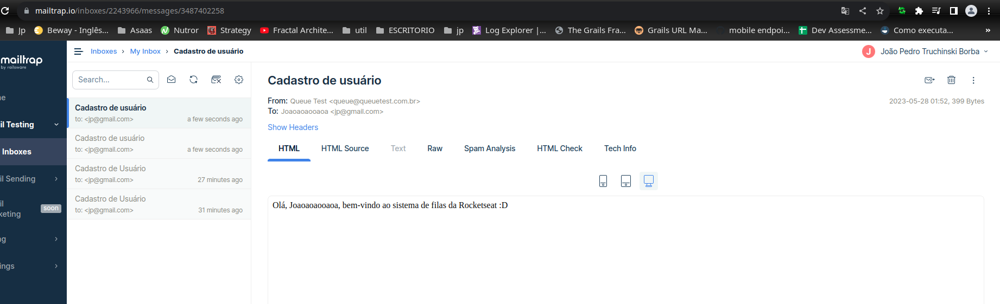

Envio de e-mail em segundo plano com Node.js utilizando a lib Bull que nos permite
 executar background tasks

Para testes em desenvolvimento foi usado o mailtrap.io, uma caixa de entrada/servidor fake. SMTP fictício.



```
curl --request POST \
--url http://localhost:3333/users \
--header 'Content-Type: application/json' \
--data '{
"name": "João Pedro Truchinski Borba",
"email": "jp@gmail.com",
"password": "123"
}'
```